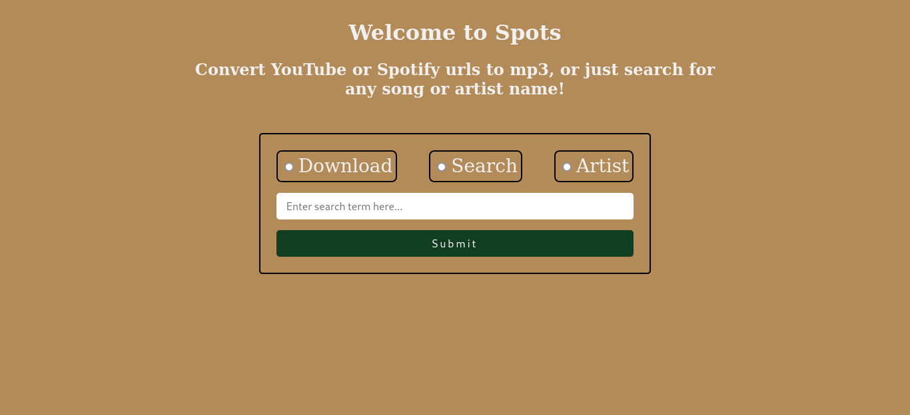
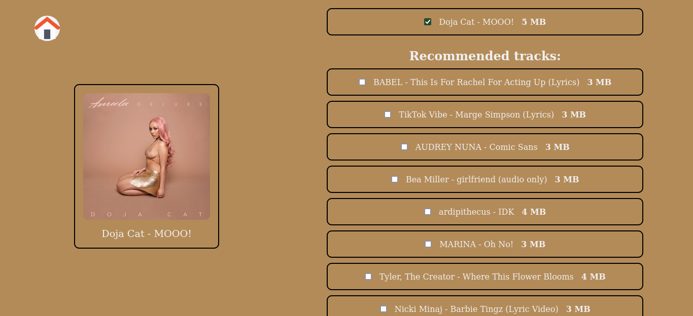
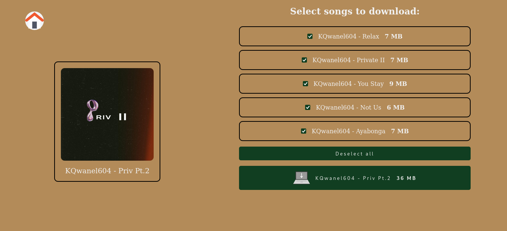

<br/>
<p align="center">
  <a href="https://github.com/mdesignscode/spots_flask">
    
  </a>

  <h1 align="center">Spots</h1>

  <h3 align="center">
    A visually appealing music converter for Spotify and YouTube
    <br/>
    <br/>
  </h3>
</p>

<br/>

<h2 style="text-align: center; color: #4CAF50;">About</h2>

<p>Embark on a tailored musical journey with a meticulously crafted converter designed for discerning music enthusiasts. This tool is your gateway to a clean, organized, and visually striking music library. Beyond a conventional conversion, it intelligently pulls song metadata from Spotify, retrieves the corresponding YouTube video, and transforms it into a seamless MP3 experience. Perfect your music collection with precision and elegance, ensuring each track resonates with your unique style.</p>

<br/>

<h2 style="text-align: center; color: #4CAF50;">Tech Stack</h2>
<div style="display: flex; gap: 1.5rem; align-items: center; justify-content: center;">
  <a style="display: flex; flex-direction: column; align-items: center; justify-content: center; gap: 1rem; cursor: pointer;" href="https://www.python.org/" class="stack_item">
    
    <p>Python</p>
  </a>

  <a href="https://flask.palletsprojects.com/en/3.0.x/" class="stack_item" style="display: flex; flex-direction: column; align-items: center; justify-content: center; gap: 1rem; cursor: pointer;">
    
    <p>Flask</p>
  </a>
</div>

<br/>

<h2 style="text-align: center; color: #4CAF50;">Key Features</h2>

<div>
  <h3>Discover Artists:</h3>
  <p style="margin-left: 1rem;">Explore your favorite artists by retrieving their albums and top tracks from Spotify.</p>
</div>

<div>
  <h3>Smart Song Search:</h3>
  <p style="margin-left: 1rem;">Effortlessly find music by searching titles, YouTube video URLs, or Spotify track URLs. Get personalized recommendations based on your preferences.</p>
</div>

<div>
  <h3>Playlist Magic:</h3>
  <p style="margin-left: 1rem;">Download entire Spotify playlists, albums, or YouTube playlists to curate your perfect collection.</p>
</div>

<br/>

<h2 style="text-align: center; color: #4CAF50;">Requirements</h2>

<strong><a href="https://www.python.org/downloads/">Python3</a></strong>
<br/>
<strong>A text editor (Notepad, Visual Studio Code, Atom, etc)</strong>
<br/>
<strong>A command line interface (Bash, Powershell, etc)</strong>
<br/>
<strong>A Spotify <a href="https://developer.spotify.com/dashboard">API key</a>.</strong>

<br/>

<h2 style="text-align: center; color: #4CAF50;">Setup</h2>

<h4>Clone this repo:</h4>

```bash
  git clone https://github.com/mdesignscode/spots_flask
```

<h4>Go to repo folder:</h4>

```bash
  cd spots_flask
```

<h4>Get api keys:</h4>

<p style="margin-left: 1rem;">Create a Spotify developer app at <a href="https://developer.spotify.com/dashboard">the Spotify developers console</a>.</p>

<p style="margin-left: 1rem;">Retrieve the <em>client secret key</em> and <em>client id</em> from the dashboard settings.</p>

<p>You can view the <a href="https://developer.spotify.com/documentation/web-api">Official docs</a> for more info on the API</p>

<br/>

<p style="margin-left: 1rem;">Create a Genius developer app at <a href="https://genius.com/api-clients/new">the Genius developers console</a>.</p>

<p style="margin-left: 1rem;">Retrieve the <em>client secret key</em> from <a href="https://genius.com/api-clients">the clients dashboard</a>.</p>

<h4>Add keys to environment:</h4>

<p style="margin-left: 1rem;">Create a file called <strong>.env</strong> at the root of the project and add the following:</p>

    SPOTIPY_CLIENT_ID=spotify_client_id
    client_secret=spotify_client_secret
    lyricsgenius_key=genius_secret_key

<h4>Create a Python virtual environment</h4>

```bash
python3 -m venv spots_venv
```

<h4>Activate environment<h4>

<p>On Windows</p>

```powershell
spots_venv\Scripts\activate
```

<p>On Linux/macOS</p>

```bash
source spots_venv/bin/activate
```

<p>Your command prompt or terminal prompt should change to indicate that you are now in the virtual environment.</p>

<h4>Install dependencies</h4>

```pip3
pip3 install -r requirements.txt
```

<h4>Start Server</h4>

```bash
python3 spots.py
```

<h2 style="text-align: center; color: #4CAF50;">Screenshots</h2>



<br/>



<br/>



<br/>

<h2 style="text-align: center; color: #4CAF50;">Disclaimer</h2>

<p><strong>Important:</strong> The Spotify API content may not be downloaded using this project. This project is created for personal use only and is intended for educational purposes. Any use of this project to download or distribute copyrighted material without proper authorization is against the terms of service of Spotify and other involved platforms. The project's author and contributors are not responsible for any misuse of this software.</p>

<br/>

<h2 style="text-align: center; color: #4CAF50;">License</h2>

This project is licensed under the MIT License - see the [LICENSE](LICENSE) file for details.

